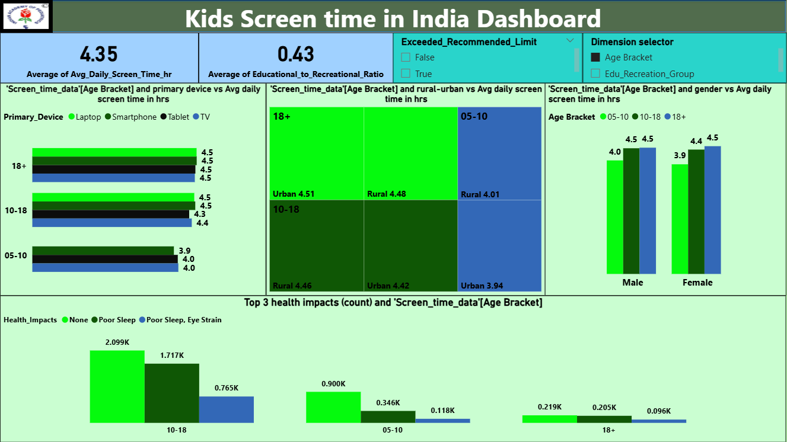
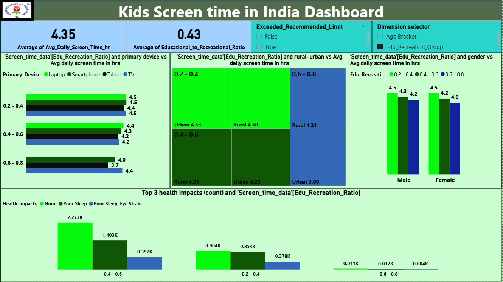

Kids Screen Time in India – Power BI Dashboard
📌 Project Overview

This project presents a Power BI dashboard analyzing screen time patterns among kids in India. The dataset was modeled, transformed, and visualized to uncover insights about device usage, age-based trends, educational vs recreational screen time, and health impacts.

The dashboard provides an interactive parameter-based view where users can analyze:

Age Brackets (05–10, 10–18, 18+)

Educational-to-Recreational Screen Time Ratio

This interactivity makes it possible to explore the same dataset from multiple perspectives, supporting data-driven decision-making for parents, educators, and health professionals.

🎯 Key Insights from the Dashboard

Average daily screen time: ~4.35 hours per child.

Education-to-Recreation ratio: Only 0.43, highlighting dominance of recreational screen use.

Device usage:

10–18 yrs spend the most time (~4.5 hrs) using smartphones & laptops.

Younger kids (05–10 yrs) average ~4 hrs on TV & tablets.

Urban vs Rural divide: Almost equal exposure (~4.4–4.5 hrs).

Gender analysis: Minimal differences; female kids show slightly higher averages in some categories.

Health impacts: Poor sleep and eye strain most common among 10–18 yrs, but 2K+ kids reported no major issues.

🛠️ Technical Highlights

Tool Used: Microsoft Power BI

Features Implemented:

Data cleaning & transformation (Power Query)

Data modeling with relationships

DAX measures for KPIs (e.g., average screen time, education/recreation ratio)

Parameter controls to toggle between Age Bracket and Edu-to-Recreation ratio views

Visual storytelling through bar charts, treemaps, and comparison visuals

Focus: Recruiter-ready project showcasing dashboard design, interactivity, and insights presentation.

📊 Dashboard Preview
Age Bracket Analysis

Educational vs Recreational Ratio Analysis

🚀 Project Value

This project demonstrates:
Ability to model, clean, and analyze data effectively.
Proficiency in Power BI dashboard design and interactivity.
Strength in storytelling with data to highlight meaningful insights.
A recruiter-facing portfolio project showcasing business intelligence and visualization expertise.
Strength in storytelling with data to highlight meaningful insights.
A recruiter-facing portfolio project showcasing business intelligence and visualization expertise.
